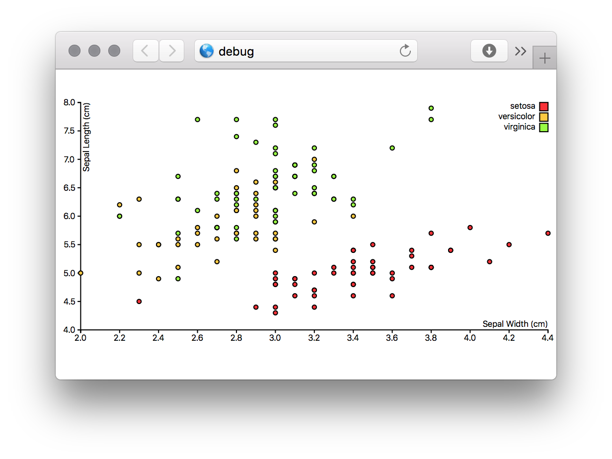

# Class 2: Debug

In this assignment I've learned to debug code. With a little help from my friends, because this was quite hard for me to read (the code and the errors)..!



## Errors I fixed (in order)

### 1. Could not find d3.tsv
We're not using a 'tsv' file but a csv file. So I changed it from:
```js
d3.tsv('index.tsv', row, onload);
```
To:
```js
d3.csv('index.csv', row, onload);
```

### 2. d3.extend is not a function
The file didn't recognize d3.extend so I changed it from:
```js
function onload(data) {
    x.domain(d3.extend(data, sepalWidth)).nice();
    y.domain(d3.extend(data, sepalLength)).nice();
```
To:
```js
function onload(data) {
    x.domain(d3.extent(data, sepalWidth)).nice();
    y.domain(d3.extent(data, sepalLength)).nice();
```

### 3. The var is stuck in the top left corner
Since the plot graph was stuck in the top left corner my guess is that the width and heigth of the var was not set properly, so I changed it from:
```js
var width = 960 - margin.l - margin.r;
var height = 500 - margin.t - margin.b;
```
To:
```js
var width = 960 - margin.left - margin.right;
var height = 500 - margin.top - margin.bottom;
```
And also this:
```js
var svg = d3
    .select('svg')
    .attr('viewBox', [
    0,
    0,
    margin.l + width + margin.r,
    margin.t + height + margin.b
  ].join(' '))
    .append('g')
    .attr('transform', 'translate(' + margin.left + ',' + margin.top + ')');
```
To:
```js
var svg = d3
    .select('svg')
    .attr('viewBox', [
    0,
    0,
    margin.left + width + margin.right,
    margin.top + height + margin.bottom
  ].join(' '))
    .append('g')
    .attr('transform', 'translate(' + margin.left + ',' + margin.top + ')');
```

### 4. It's time to change d3 v3 to d3 v4
The assignment said to change D3 v3 to the fourth version. So changing this:
```js
<script src=https://d3js.org/d3.v3.min.js></script>
```
To:
```js
<script src=https://d3js.org/d3.v4.min.js></script>
```

### 5. TypeError: undefined is not an object (evaluatin 'd3.scale.linear)
Because we are now working with D3 V4 this object didn't work anymore. So I changed it from:
```js
var x = d3.scale.linear().range([0, width]);
var y = d3.scale.linear().range([height, 0]);
var color = d3.scale.ordinal().range(['#fe2f2f', '#feca2f', '#96fe2f']);
var xAxis = d3.svg.axis().scale(x).orient('bottom');
var yAxis = d3.svg.axis().scale(y).orient('left');
```
To:
```js
var x = d3.scaleLinear().range([0, width]);
var y = d3.scaleLinear().range([height, 0]);
var color = d3.scaleOrdinal().range(['#fe2f2f', '#feca2f', '#96fe2f']);
var xAxis = d3.axisBottom(x);
var yAxis = d3.axisLeft(y);
```

### In the CSS
Changed the CSS from:
```js
  svg {
    width: 100w;
    height: 100h;
  }
  
  .axis path {
    fill: no;
  }
```
To:
```js
  svg {
    width: 100vw;
    height: 100vh;
  }
  
  .axis path {
    fill: none;
  }
```

## Features

*   [`d3.scale.linear`](https://github.com/d3/d3-3.x-api-reference/blob/master/Quantitative-Scales.md#_linear)
*   [`d3.scale.ordinal`](https://github.com/d3/d3-3.x-api-reference/blob/master/Ordinal-Scales.md#ordinal)
*   [`d3.svg.axis`](https://github.com/d3/d3-3.x-api-reference/blob/master/SVG-Axes.md#axis)
*   [`d3.extent`](https://github.com/d3/d3-3.x-api-reference/blob/master/Arrays.md#d3_extent)
*   [`d3.csv`](https://github.com/d3/d3-3.x-api-reference/blob/master/CSV.md#csv)

## License

MIT © Lucas Berghoef
